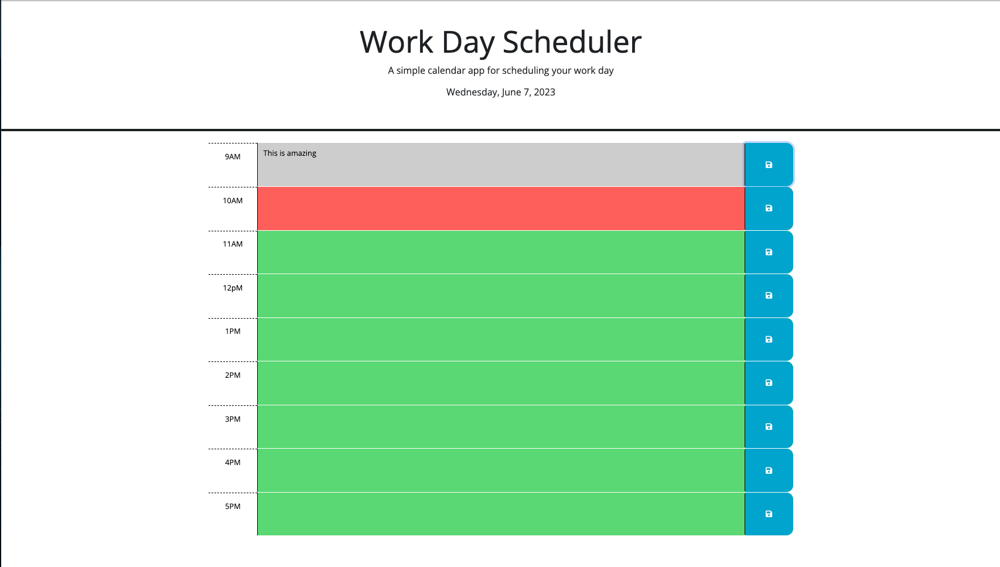

# Event Effective Immediately

## Description
This was a task focused on using JQUERY and Day.JS to build a planner page that keeps rack of the current time and if a task is past due(grey), due on that hour(red), or if the task still has time to be completed (green). This webpage uses localstorage to keep track of specific things written in each time block after the save button is pressed, and pull from local storage when the page is reloaded in order to give the user an easy experience keeping trakc of their assingemnts and meetings.  

## Credits
This webpage was created by Bryce Lingle. If you ahve questions or comments, please feel free to reach out to me at brycealingle@gmail.com. In order to complete this assignment.

## Image

## Links
Come see my page!
https://bryce-lingle.github.io/Events-Effective-Immediately/ 

Come see my gitHub!
https://github.com/Bryce-Lingle/Events-Effective-Immediately 

